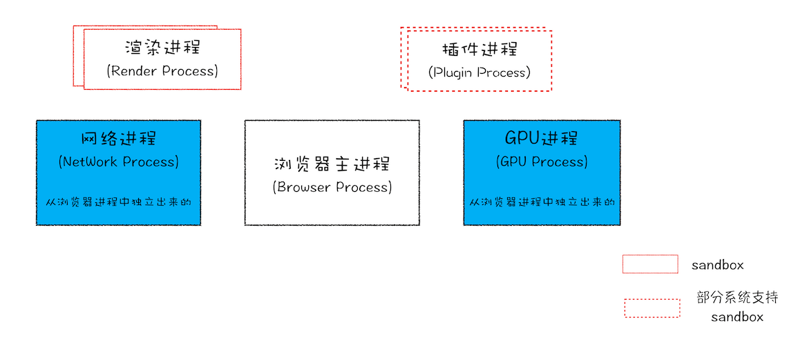

# 浏览器知识

## 基础知识

### 线程和进程

> 进程（process）和线程（thread）是操作系统的基本概念

进程是 CPU 资源分配的最小单位（是能拥有资源和独立运行的最小单位）<br />
线程是 CPU 调度的最小单位（是建立在进程基础上的一次程序运行单位）<br />

**一个进程就是一个程序的运行实例**：启动一个程序时，操作系统会为该程序创建一块内存，用来存放代码、运行中的数据和一个执行任务的主线程，我们把这样的一个运行环境叫**进程**

**线程是进程内的一个执行单元**：线程是不能单独存在的，是依附于进程并由进程来启动和管理的

::: tip 进程和线程的关系特点

- 进程是拥有资源的基本单位；线程是调度和分配的基本单位（是进程内的一个执行单元，也是进程内的可调度实体）
- 进程之间相互隔离，互不干扰
- 一个进程中可以并发执行多个线程
- 一个线程只能隶属于一个进程，而一个进程是可以拥有多个线程的（但至少有一个主线程）
- 同一进程的所有线程共享该进程的所有数据
- 进程中的任意一线程执行出错，都会导致整个进程的崩溃
- 当一个进程关闭之后，操作系统会回收进程所占用的内存

:::

### Chrome 打开一个页面会有几个进程？

> 最新的 Chrome 多进程架构图



- **浏览器主进程**：负责界面显示、用户交互、子进程管理，同时提供存储等功能
- **渲染进程**：负责将 `HTML` `CSS` 和 `JavaScript` 转换为用户可以与之交互的网页
  - 排版引擎 Blink 和 JavaScript 引擎 V8 都是运行在该进程中
  - 默认情况下 Chrome 会为每个 Tab 标签创建一个渲染进程
  - 出于安全考虑渲染进程都是运行在沙箱模式下
- **GPU 进程**：负责网页、Chrome 的 UI 界面的绘制
- **网络进程**：负责页面的网络资源加载（之前是作为一个模块运行在浏览器进程）
- **插件进程**：负责插件的运行（因为插件易崩溃所以需要通过插件进程来隔离，以保证插件崩溃不会对浏览器和页面造成影响）

[Chrome 架构：仅仅打开了 1 个页面，为什么有 4 个进程？—— 浏览器工作原理与实践](https://time.geekbang.org/column/article/113513)

## 跨域

::: tip 跨域的原因 —— 浏览器的同源策略

[同源策略](https://developer.mozilla.org/zh-CN/docs/Web/Security/Same-origin_policy)是浏览器一个重要的安全策略，它用于限制一个 `origin` 的文档或者它加载的脚本如何能与另一个源的资源进行交互。它能帮助阻隔恶意文档，减少可能被攻击的媒介

同源的定义是两个 `URL` 的 **协议**、**域名**(子域名 + 主域名)、**端口号** 都相同，否则就会出现跨域

:::

::: tip 同源策略的限制范围

1. 限制跨源网络访问: `AJAX` 请求不能发送
2. 限制跨源脚本 `API` 访问: `DOM` 无法获得
3. 限制跨源数据存储访问: `Cookie` `LocalStorage` 和 `IndexDB` 无法读取

一般常说的跨域指网络跨域

:::

### 常用的跨域解决方案

::: tip 常用的跨域解决方案

1. **CORS**
2. **JSONP**
3. Nginx 反向代理
4. WebSocket
5. postMessage
6. document.domain

:::

### CORS 跨源资源共享

[CORS (跨源资源共享)](https://developer.mozilla.org/zh-CN/docs/Web/HTTP/CORS) 是 [HTTP](https://developer.mozilla.org/zh-CN/docs/Glossary/HTTP) 的一部分，它允许浏览器向跨源服务器发出 `XMLHttpRequest` 请求，从而解决了 `AJAX` 只能同源使用的限制。

> `CORS` 需要浏览器和服务器同时支持，目前所有浏览器均已支持，只需服务器配置即可使用

浏览器将 `CORS` 请求分成两类: **简单请求**和**非简单请求**

#### 简单请求

::: tip 简单请求必须同时满足以下条件

> 日常开发只会关注前两点

- 请求方法是以下三种方法之一
  - `HEAD`
  - `GET`
  - `POST`
- 只使用了如下的安全首部字段，不得人为设置其他首部字段
  - `Accept`
  - `Accept-Language`
  - `Content-Language`
  - `Content-Type` 仅限以下三种
    - `application/x-www-form-urlencoded`
    - `multipart/form-data`
    - `text/plain`
- 请求中的任意 `XMLHttpRequestUpload` 对象均没有注册任何事件监听器(使用 `XMLHttpRequest.upload` 属性访问`XMLHttpRequestUpload` 对象)
- 请求中没有使用 `ReadableStream` 对象

:::

##### 简单请求基本流程

1. 浏览器会直接发出 `CORS` 请求并在请求头信息之中增加一个 `Origin` 字段(用来说明本次请求来自哪个源(协议 + 域名 + 端口))
2. 服务器判断 `Origin` 字段决定是否同意这次请求
   1. 通过请求会在响应头增加 `CORS` 相关的字段(以`Access-Control-`开头)
   2. 拒绝请求时不会增加 `CORS` 相关的字段，浏览器会抛出异常

::: tip 简单请求响应头中的 CORS 字段

- `Access-Control-Allow-Origin`: 只能是 `*`(接受任意域名的请求)或者是请求时 `Origin` 字段的值
- `Access-Control-Allow-Credentials`(可选): 是一个布尔值,表示是否允许发送 `Cookie`
- `Access-Control-Expose-Headers`(可选): `CORS` 请求时 `XMLHttpRequest` 对象的 `getResponseHeader()` 方法只能拿到 6 个基本字段：`Cache-Control、Content-Language、Content-Type、Expires、Last-Modified、Pragma`。如果想拿到其他字段就必须在 `Access-Control-Expose-Headers` 里面指定

:::

::: tip CORS 中的 Cookie 设置

`CORS` 请求默认不发送 `Cookie`，如果需要发送需要满足如下条件

- 服务器必须设置 `Access-Control-Allow-Credentials: true`
- `Access-Control-Allow-Origin` 字段不能为 `*`
- `AJAX` 请求的配置项需设置 `withCredentials = true`

:::

#### 非简单请求

非简单请求是那种对服务器有特殊要求的请求，如请求方法是 `PUT` 或 `DELETE`，或者 `Content-Type` 字段的类型是 `application/json`。<br />
非简单请求会在正式通信之前增加一次 `HTTP` 查询请求，称为**预检请求**，用于获取服务器是否允许该实际请求，同时避免跨域请求对服务器的用户数据产生预期之外的影响

::: tip 预检请求

预检请求用的请求方法是 `OPTIONS` 表示这个请求是用来询问的

- 在预检请求请求头信息里会包含如下字段
  - `Origin`: 表示本次请求来自哪个源
  - `Access-Control-Request-Method`: 用于列出浏览器的 `CORS` 请求会用到哪些 `HTTP` 方法
  - `Access-Control-Request-Headers`(可选): 指定浏览器 `CORS` 请求会额外发送的头信息字段
- 服务器通过后会在预检请求响应头中设置如下字段
  - `Access-Control-Allow-Origin`
  - `Access-Control-Allow-Credentials`(可选)
  - `Access-Control-Allow-Methods`: 表示服务器支持的所有跨域请求的方法(为了避免多次预检请求)
  - `Access-Control-Allow-Headers`: 表示服务器支持的所有头信息字段，不限于浏览器在预检中请求的字段
  - `Access-Control-Max-Age`(可选): 用来指定本次预检请求的有效期单位为秒，在有效期内将不发出另一条预检请求

:::

一旦服务器通过了预检请求，以后每次浏览器正常的 `CORS` 请求，就都跟简单请求一样会有一个 `Origin` 头信息字段。服务器的回应也都会有一个 `Access-Control-Allow-Origin` 头信息字段

::: details CORS 请求过程

:::

[参考资料 —— 跨域资源共享 CORS 详解](http://www.ruanyifeng.com/blog/2016/04/cors.html)

### JSONP

`JSONP` 是利用 `<script>` 标签没有跨域限制的漏洞，当前源可以得到从其他来源动态产生的 `JSON` 数据

**`JSONP` 请求过程流程**

1. 前端定义一个解析的回调函数
2. 创建 `script` 标签，其 `src` 指向接口地址并拼接好参数和回调函数名
3. 后端处理数据并将其拼接到前端传入的回调函数中(拼接好的数据必须是一个合法的 `JavaScript` 脚本 )
4. 浏览器执行后端返回的 `JavaScript` 脚本代码(调用定义好的回调函数)并删除刚创建的 `script` 标签

::: details JSONP 代码实现

```js
function normalizeParams(params) {
  if (!params) {
    return ''
  }
  return Object.keys(params)
    .map((key) => `${key}=${params[key]}`)
    .join('&')
}

function jsonp(url, params) {
  return new Promise((resolve) => {
    const callback = `jsonp_${Date.now()}`
    window[callback] = function (data) {
      resolve(data)
      document.body.removeChild(scriptEle)
    }
    params.cb = callback
    const scriptEle = document.createElement('script')
    scriptEle.src = `${url}${url.includes('?') ? '&' : '?'}${normalizeParams(params)}`
    document.body.appendChild(scriptEle)
  })
}

jsonp('https://www.baidu.com/sugrec', {
  prod: 'pc',
  wd: '跨域'
}).then((res) => {
  console.log(res)
})
```

:::

::: tip JSONP 跨域优缺点

- 优点: 实现简单，兼容性好
- 缺点
  - 只支持 `GET` 请求
  - 容易遭受 `XSS` 攻击

:::

[了解更多跨域解决方案请点击 —— 10 种跨域解决方案](https://juejin.cn/post/6844904126246027278)


