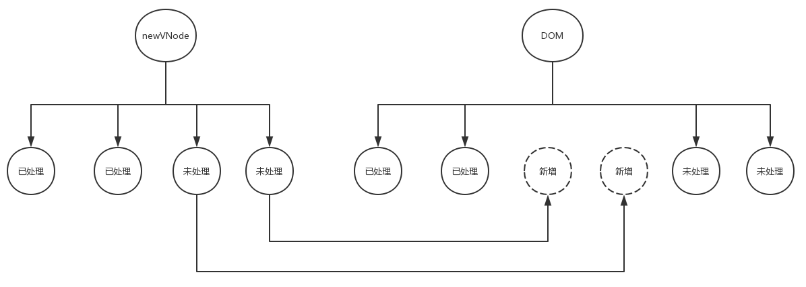
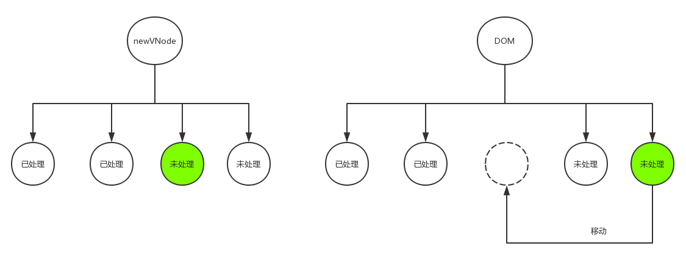

## 1. 前言

在上一篇文章中，我们了解了`Vue`中的`patch`过程，即`DOM-Diff`算法。并且知道了在`patch`过程中基本会干三件事，分别是：创建节点，删除节点和更新节点。创建节点和删除节点都比较简单，而更新节点因为要处理各种可能出现的情况所以逻辑略微复杂一些，但是没关系，我们通过分析过程，对照源码，画逻辑流程图来帮助我们理解了其中的过程。最后我们还遗留了一个问题，那就是在更新节点过程中，新旧`VNode`可能都包含有子节点，对于子节点的对比更新会有额外的一些逻辑，那么在本篇文章中我们就来学习在`Vue`中是怎么对比更新子节点的。

## 2. 更新子节点

当新的`VNode`与旧的`oldVNode`都是元素节点并且都包含子节点时，那么这两个节点的`VNode`实例上的`children`属性就是所包含的子节点数组。我们把新的`VNode`上的子节点数组记为`newChildren`，把旧的`oldVNode`上的子节点数组记为`oldChildren`，我们把`newChildren`里面的元素与`oldChildren`里的元素一一进行对比，对比两个子节点数组肯定是要通过循环，外层循环`newChildren`数组，内层循环`oldChildren`数组，每循环外层`newChildren`数组里的一个子节点，就去内层`oldChildren`数组里找看有没有与之相同的子节点，伪代码如下：

```javascript
for (let i = 0; i < newChildren.length; i++) {
  const newChild = newChildren[i];
  for (let j = 0; j < oldChildren.length; j++) {
    const oldChild = oldChildren[j];
    if (newChild === oldChild) {
      // ...
    }
  }
}
```

那么以上这个过程将会存在以下四种情况：

- 创建子节点

  如果`newChildren`里面的某个子节点在`oldChildren`里找不到与之相同的子节点，那么说明`newChildren`里面的这个子节点是之前没有的，是需要此次新增的节点，那么就创建子节点。

- 删除子节点

  如果把`newChildren`里面的每一个子节点都循环完毕后，发现在`oldChildren`还有未处理的子节点，那就说明这些未处理的子节点是需要被废弃的，那么就将这些节点删除。

- 移动子节点

  如果`newChildren`里面的某个子节点在`oldChildren`里找到了与之相同的子节点，但是所处的位置不同，这说明此次变化需要调整该子节点的位置，那就以`newChildren`里子节点的位置为基准，调整`oldChildren`里该节点的位置，使之与在`newChildren`里的位置相同。

- 更新节点

  如果`newChildren`里面的某个子节点在`oldChildren`里找到了与之相同的子节点，并且所处的位置也相同，那么就更新`oldChildren`里该节点，使之与`newChildren`里的该节点相同。

OK，到这里，逻辑就相对清晰了，接下来我们只需分门别类的处理这四种情况就好了。

## 3. 创建子节点

如果`newChildren`里面的某个子节点在`oldChildren`里找不到与之相同的子节点，那么说明`newChildren`里面的这个子节点是之前没有的，是需要此次新增的节点，那么我们就创建这个节点，创建好之后再把它插入到`DOM`中合适的位置。

创建节点这个很容易，我们在上一篇文章的第三章已经介绍过了，这里就不再赘述了。

那么创建好之后如何插入到`DOM`中的合适的位置呢？显然，把节点插入到`DOM`中是很容易的，找到合适的位置是关键。接下来我们分析一下如何找这个合适的位置。我们看下面这个图：


上图中左边是新的`VNode`，右边是旧的`oldVNode`，同时也是真实的`DOM`。这个图意思是当我们循环`newChildren`数组里面的子节点，前两个子节点都在`oldChildren`里找到了与之对应的子节点，那么我们将其处理，处理过后把它们标志为已处理，当循环到`newChildren`数组里第三个子节点时，发现在`oldChildren`里找不到与之对应的子节点，那么我们就需要创建这个节点，创建好之后我们发现这个节点本是`newChildren`数组里左起第三个子节点，那么我们就把创建好的节点插入到真实`DOM`里的第三个节点位置，也就是所有已处理节点之后，OK，此时我们拍手称快，所有已处理节点之后就是我们要找的合适的位置，但是真的是这样吗？我们再来看下面这个图：


假如我们按照上面的方法把第三个节点插入到所有已处理节点之后，此时如果第四个节点也在`oldChildren`里找不到与之对应的节点，也是需要创建的节点，那么当我们把第四个节点也按照上面的说的插入到已处理节点之后，发现怎么插入到第三个位置了，可明明这个节点在`newChildren`数组里是第四个啊！

这就是问题所在，其实，我们应该把新创建的节点插入到所有未处理节点之前，这样以来逻辑才正确。后面不管有多少个新增的节点，每一个都插入到所有未处理节点之前，位置才不会错。

所以，**合适的位置是所有未处理节点之前，而并非所有已处理节点之后**。

## 4. 删除子节点

如果把`newChildren`里面的每一个子节点都循环一遍，能在`oldChildren`数组里找到的就处理它，找不到的就新增，直到把`newChildren`里面所有子节点都过一遍后，发现在`oldChildren`还存在未处理的子节点，那就说明这些未处理的子节点是需要被废弃的，那么就将这些节点删除。

删除节点这个也很容易，我们在上一篇文章的第四章已经介绍过了，这里就不再赘述了。

## 5. 更新子节点

如果`newChildren`里面的某个子节点在`oldChildren`里找到了与之相同的子节点，并且所处的位置也相同，那么就更新`oldChildren`里该节点，使之与`newChildren`里的该节点相同。

关于更新节点，我们在上一篇文章的第五章已经介绍过了，这里就不再赘述了。

## 6. 移动子节点

如果`newChildren`里面的某个子节点在`oldChildren`里找到了与之相同的子节点，但是所处的位置不同，这说明此次变化需要调整该子节点的位置，那就以`newChildren`里子节点的位置为基准，调整`oldChildren`里该节点的位置，使之与在`newChildren`里的位置相同。

同样，移动一个节点不难，关键在于该移动到哪，或者说关键在于移动到哪个位置，这个位置才是关键。我们看下图：


在上图中，绿色的两个节点是相同节点但是所处位置不同，即`newChildren`里面的第三个子节点与真实`DOM`即`oldChildren`里面的第四个子节点相同但是所处位置不同，按照上面所说的，我们应该以`newChildren`里子节点的位置为基准，调整`oldChildren`里该节点的位置，所以我们应该把真实`DOM`即`oldChildren`里面的第四个节点移动到第三个节点的位置，通过上图中的标注我们不难发现，**所有未处理节点之前就是我们要移动的目的位置**。如果此时你说那可不可以移动到所有已处理节点之后呢？那就又回到了更新节点时所遇到的那个问题了：如果前面有新增的节点呢？

## 7. 回到源码

OK，以上就是更新子节点时所要考虑的所有情况了，分析完以后，我们回到源码里看看实际情况是不是我们分析的这样子的，源码如下：

```javascript
// 源码位置： /src/core/vdom/patch.js

if (isUndef(idxInOld)) {    // 如果在oldChildren里找不到当前循环的newChildren里的子节点
    // 新增节点并插入到合适位置
    createElm(newStartVnode, insertedVnodeQueue, parentElm, oldStartVnode.elm, false, newCh, newStartIdx)
} else {
    // 如果在oldChildren里找到了当前循环的newChildren里的子节点
    vnodeToMove = oldCh[idxInOld]
    // 如果两个节点相同
    if (sameVnode(vnodeToMove, newStartVnode)) {
        // 调用patchVnode更新节点
        patchVnode(vnodeToMove, newStartVnode, insertedVnodeQueue)
        oldCh[idxInOld] = undefined
        // canmove表示是否需要移动节点，如果为true表示需要移动，则移动节点，如果为false则不用移动
        canMove && nodeOps.insertBefore(parentElm, vnodeToMove.elm, oldStartVnode.elm)
    }
}
```

以上代码中，首先判断在`oldChildren`里能否找到当前循环的`newChildren`里的子节点，如果找不到，那就是新增节点并插入到合适位置；如果找到了，先对比两个节点是否相同，若相同则先调用`patchVnode`更新节点，更新完之后再看是否需要移动节点，注意，源码里在判断是否需要移动子节点时用了简写的方式，下面这两种写法是等价的：

```javascript
canMove && nodeOps.insertBefore(parentElm, vnodeToMove.elm, oldStartVnode.elm)
// 等同于
if(canMove){
  nodeOps.insertBefore(parentElm, vnodeToMove.elm, oldStartVnode.elm)
}
```

我们看到，源码里的实现跟我们分析的是一样一样的。

## 8. 总结

本篇文章我们分析了`Vue`在更新子节点时是外层循环`newChildren`数组，内层循环`oldChildren`数组，把`newChildren`数组里的每一个元素分别与`oldChildren`数组里的每一个元素匹配，根据不同情况作出创建子节点、删除子节点、更新子节点以及移动子节点的操作。并且我们对不同情况的不同操作都进行了深入分析，分析之后我们回到源码验证我们分析的正确性，发现我们的分析跟源码的实现是一致的。

最后，我们再思考一个问题：这样双层循环虽然能解决问题，但是如果节点数量很多，这样循环算法的时间复杂度会不会很高？有没有什么可以优化的办法？答案当然是有的，并且`Vue`也意识到了这点，也进行了优化，那么下篇文章我们就来分析当节点数量很多时`Vue`是怎么优化算法的。
